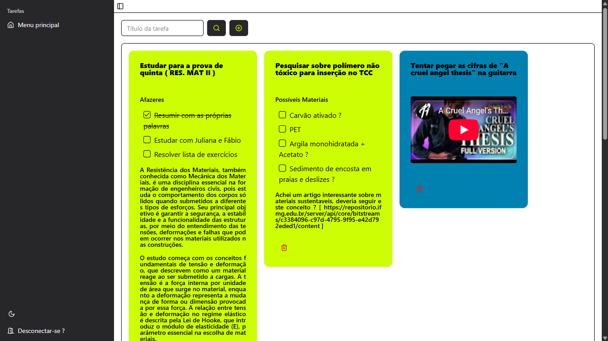

# Vaga para Desenvolvedor PHP

Este projeto é um teste técnico para a vaga de Desenvolvedor PHP, onde é utilizando Vite, React, TailwindCSS para estilização, ShadCN UI para modelos pré prontos, DnD para funcionalidade de arrastar blocos de descrição, React Hook Form para formulários performáticos e reativos, Sonner para avisos de conclusão ou erro e Zod para tipagem de formulários

## Começando o projeto

### Configurar o sistema

-   Vá para a pasta que você deseja clonar este repositório `cd ~/SUA_PASTA_DE_REPOSITORIOS`
-   Clone este repositório: `git clone https://github.com/Buraym/stoix-test-frontend/ stoix-test-frontend`
-   Entre na pasta: `cd stoix-test-frontend`
-   Instale as dependências usando NPM -> `npm install` | YARN -> `yarn` ( preferencialmente )
-   Adicione as variáveis de ambiente `VITE_API_HOST` para poder direcionar para o host backend, criando um aplicativo `.env`

### Trabalhando no projeto

As pastas foram dividas em `assets`, para arquivos como fontes de texto, logos e recursos visuais em geral, `components`, contando com o arquivo de troca rápida de estilos visuais ( tema claro e escuro ), e a pasta `ui`, para componentes visuais em React, `hooks` para ganchos lógicos, como verificação de responsividade para mobile, `interfaces` para as tipagens de interface de formulários e outros componentes do sistema, `layouts` para diferentes tipos de quadro com o intuíto de separação entre interface de usuário conectado e não conectado, `lib` para arquivo de concatenação de estilos, como um ferramenta rápida para estilização, `pages` para páginas principais de dentro dos quadros, `utils` para ferramentas utilizadas o tempo todo, como API, decodificação de URL de vídeo de youtube, e outras funções.

## Autenticação

O projeto utiliza o token enviado pelo Cookie XRSF-TOKEN, enviado pelo Backend Laravel na rota `sanctum/crsf-cookie` quando faz a requisição para Conectar o usuario, logo após é redirecionado para o painel principal. Caso o usuário não esteja logado, o site irá redirecionar para a página de login, isso pois toda vez que entra em uma rota, o loader desta faz uma requisição para o backend para verificar se o token está ativo, e caso não esteja, enviará uma resposta de status `401 UNATHORIZED`, ou retornará o usuário como resposta normal.

## Funcionalidades do app

Este app têm três funcionalidades, que seria a tarefa, as descrições desta e a lista, e todas podem ser criadas á partir da rota _/create-task_. Para criar uma simples tarefa, esta só contará com título e cor, sendo esta a cor de fundo da aplicação, geralmente usada como só um lembrete simples, porem caso seja necessário uma descrição, você poderá criar diversos blocos de descrição, para organização e para inserção de possíveis conteúdos, como por exemplo: Clara, estudante de Engenharia Civil, precisa se lembrar de revisar o conteúdo, então para efetuar esta tarefa, Clara irá para o painel principal, depois irá clicar no botão com um ícone de mais no topo, e será redirecionado para a página. Logo após, esta deverá definir o título e a cor, e depois clicar em `Adicionar descrição`, e assim será adcionado um bloco com uma caixa de seleção com as opções `Texto simples`, `Imagem`, `Vídeo ( Youtube )` e `Lista de afazeres`, e cada um destes pode adicionar um tipo de descrição, por exemplo, o texto simples é um parágrafo onde Clara pode resumir o conteúdo de forma simplificado, na opção de imagem, clara irá selecionar as imagens que fotografou do livro de HandBook de Engenharia Civil que ela pegou emprestado na livraria no seu computador e as imagens estarão como parte da tarefa, em relação ao vídeo, Clara irá selecionar um vídeo do youtube, clicar em compartilhar, escolher a opção "Incorporado", copiar o conteúdo e colar na caixa de texto, formando assim o vídeo dentro da caixa, no entanto, para clara criar a mecânica de listas de afazeres, Clara deverá selecionar a opção de Lista de afazeres, criar um título da lista no input de texto abaixo e depois clicar no botão com o simbolo de mais, criando assim um item da lista, assim, quando todas as descrições forem criadas Clara poderá clicar no botão `Registrar tarefa`, sendo redirecionado para o painel principal, e assim ela poderá Estudar para a matéria de Resistência de Materiais. No entanto, caso Clara queira adicionar mais coisas ou alterar algum item, ela deverá clicar no nome da tarefa, e depois ser redirecionada para a página de atualização desta, podendo assim redefinir quaisquer items que esta quiser.

## Rotas utilizadas

O projeto conta com um total de 14 rotas, sendo principalmente 4 rotas de CRUD para cada uma, e duas rotas, uma de importação de CSV e outra importação de reportes de PDF

| ROTA                |                FUNÇÃO                 | ROTA AUTENTICADA |
| ------------------- | :-----------------------------------: | :--------------: |
| _/auth_             |           Login de usuário            |       Não        |
| _/auth/register_    |          Registro de usuário          |       Não        |
| _/_                 | Painel principal com lista de tarefas |       Sim        |
| _/create-task_      |           Criação de tarefa           |       Sim        |
| _/create-task/:id/_ | Visualização e atualização de tarefa  |       Sim        |

### Fotos das telas

Aqui estão algumas fotos das telas do app

